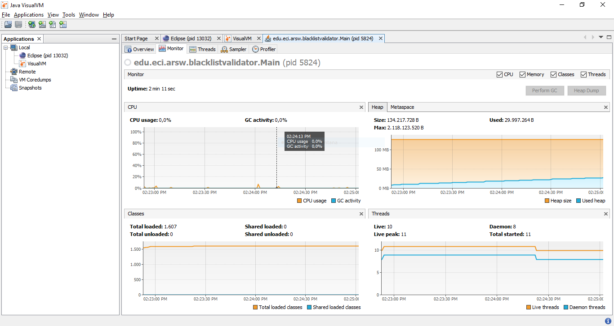
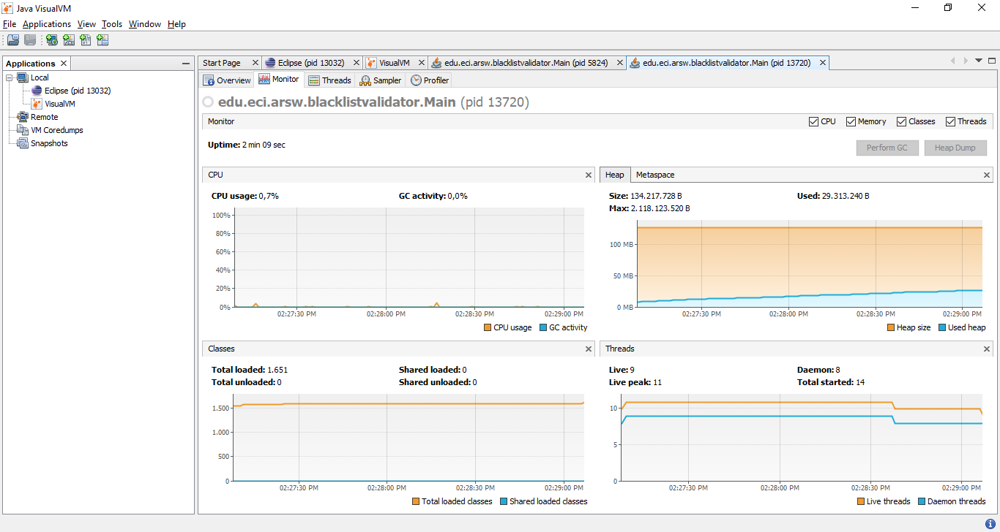
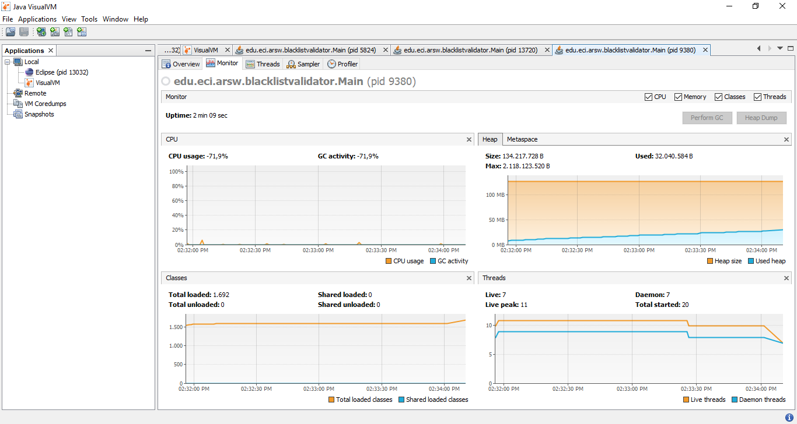
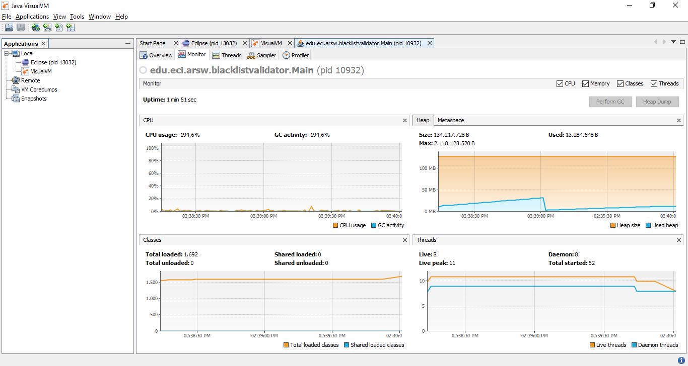
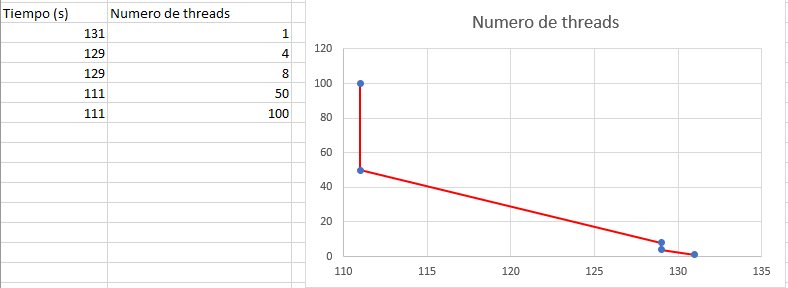

# Laboratorio-1-ARSW
# Integrantes:
### Nicolas Ortega Limas
### German Ospina Quintero 

 1. In agreement with the lectures, complete the classes CountThread, so that they define the life cycle of a thread that prints the numbers between A and B on the screen.  
 2. Complete the main method of the CountMainThreads class so that:                                                                                         
2.1 Create 3 threads of type CountThread, assigning the first interval [0..99], the second [99..199], and the third [200..299].        
2.2 Start the three threads with start(). Run and check the output on the screen.   
2.3 Change the beginning with start() to run(). How does the output change? Why?  
	- Al usar el metodo start() se crea un nuevo hilo y la salida dependera de la 	eficiencia de cada hilo.
	- Mientras, que al usar el metodo run() solo se ejecutara un hilo, es decir, de 	manera secuencial.
### Discusión
The strategy of parallelism previously implemented is inefficient in certain cases, since the search is still carried out even when the N threads (as a whole) have already found the minimum number of occurrences required to report to the server as malicious. How could the implementation be modified to minimize the number of queries in these cases? What new element would this bring to the problem?      
<<<<<<< HEAD:Black List Search/README.md

Se podría añadir una nueva funcionalidad que tenga como finalidad detener la ejecución de todos los hilos que se esten ejecutando, en el momento y posteriormente, cuando se cumpla la condición.
Se podría usar la clase ExecutorService que implementa el patrón ThreadPool que permite operar varias tareas, en hilos independientes, conforme las recibe. Este modelo aumenta el rendimiento y evita la latencia en la ejecución, debido a la creación y destrucción de hilos con pocas tareas.

=======
Se podría añadir una nueva funcionalidad que tenga como finalidad detener la ejecución de todos los hilos que se esten ejecutando, en el momento y posteriormente, cuando se cumpla la condición.
Se podría usar la clase ExecutorService que implementa el patrón ThreadPool que permite operar varias tareas, en hilos independientes, conforme las recibe. Este modelo aumenta el rendimiento y evita la latencia en la ejecución, debido a la creación y destrucción de hilos con pocas tareas.
>>>>>>> 393ac70366619262151e7a532bfe8bba055eabf7:README.md
### Performance Evaluation 
 1. A single thread
 
 2. As many threads as processing cores
 
 3. As many threads as twice the number of processing cores
 
 4. 50 threads
 
 5. 100 threads
 
 
With the above, and with the given execution times, make a graph of solution time vs. Number of threads. Analyze and hypothesize with your partner for the following questions (you can take into account what was reported by jVisualVM):

According to Amdahls law, where S(n) is the theoretical improvement of performance, P the parallel fraction of the algorithm, and n the number of threads, the greater n, the better this improvement should be. Why is the best performance not achieved with the 500 threads? How is this performance compared when using 200 ?.

El resultado que se obtuvo con 200 threads fue una ejecucion de 140 segundos comparado al de 500 con 139 segundos, luego se infiere que el rendimiento no se disminuye drasticamente en ninguno de los dos casos, esto ratifica el postulado por Amdahl que establebece que ea mayor cantidad de nucleos mejor sera el desempeño siempre y cuando no se tengan muchas instrucciones seriales o secuenciales.

How does the solution behave using as many processing threads as cores compared to the result of using twice as much?

El resultado obtenido es el mismo aunque internamente vendria a ser una mejor estrategia usar la misma cantidad de threads que de nucleos, ya que al superar su capacidad en hardware se debe recurrir a realizar la ejecucion concurrentemente.

According to the above, if for this problem instead of 100 threads in a single CPU could be used 1 thread in each of 100 hypothetical machines, Amdahls law would apply better ?. If x threads are used instead of 100/x distributed machines (where x is the number of cores of these machines), would it be improved? Explain your answer.

Nuevamente ratificamos la limitación del hardware respecto al rendimiento, infiriendo que a mayor cantidad de nucleos mejor sera el desempeño siempre y cuando estas sean paralelisables, luego en el caso de tener 1 hilo por maquina se estaría dando la ley de Amdahl en su forma física mas precisa.
