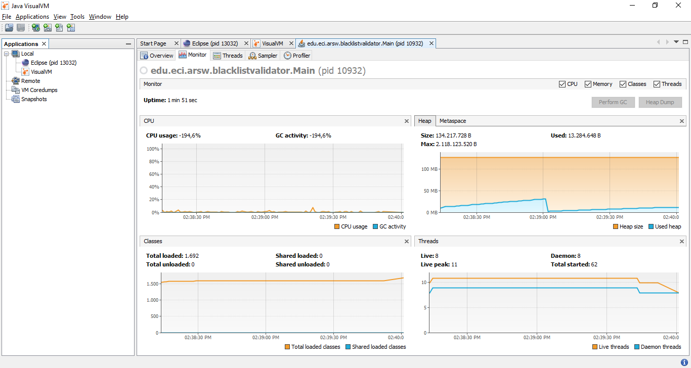

# Laboratorio-1-ARSW
# Integrantes:
### Nicolas Ortega Limas
### German Ospina Quintero

 1. In agreement with the lectures, complete the classes CountThread, so that they define the life cycle of a thread that prints the numbers between A and B on the screen.  
 2. Complete the main method of the CountMainThreads class so that:                                                                                         
2.1 Create 3 threads of type CountThread, assigning the first interval [0..99], the second [99..199], and the third [200..299].        
2.2 Start the three threads with start(). Run and check the output on the screen.   
2.3 Change the beginning with start() to run(). How does the output change? Why?  
	- Al usar el metodo start() se crea un nuevo hilo y la salida dependera de la 	eficiencia de cada hilo.
	- Mientras, que al usar el metodo run() solo se ejecutara un hilo, es decir, de 	manera secuencial.
### Discusión
The strategy of parallelism previously implemented is inefficient in certain cases, since the search is still carried out even when the N threads (as a whole) have already found the minimum number of occurrences required to report to the server as malicious. How could the implementation be modified to minimize the number of queries in these cases? What new element would this bring to the problem?      
Se podría añadir una nueva funcionalidad que tenga como finalidad detener la ejecución de todos los hilos que se esten ejecutando, en el momento y posteriormente, cuando se cumpla la condición. 
### Performance Evaluation 
 1. A single thread
 
 2. As many threads as processing cores
 
 3. As many threads as twice the number of processing cores
 
 4. 50 threads
 
 5. 100 threads
 
